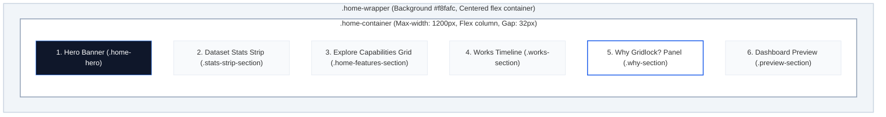

# Gridlock Bengaluru: Home Page Sections Layout

This document outlines the layout, visual structure, styles, and responsive behaviors of the landing/home page for the **Gridlock Bengaluru Traffic Command Center**.

The layout is implemented in [Home.jsx](file:///c:/Developement/gridlock_H/traffic-dashboard/src/pages/Home.jsx) and styled using classes defined in [index.css](file:///c:/Developement/gridlock_H/traffic-dashboard/src/index.css#L1039-L1478).

---

## 📐 Overall Visual Structure

The layout is arranged vertically within a centered, responsive container with a consistent gap spacing of `32px`. Additionally, a global 1.2% opacity photographic grain overlay is applied via a `body::before` pseudo-element to add texture to the layout.

---

## 🧱 Sections Breakdown

### 1. Hero Banner (`.home-hero`)
A photographic dark panel serving as the entry hook, positioned at the top of the container.
*   **HTML Element:** `<section className="home-hero">`
*   **Visual Style:** 
    *   Full-bleed WebP background photo (`traffic1.webp`) optimized to 170 KB.
    *   **Desktop:** Left-to-right gradient overlay (`linear-gradient(90deg, rgba(15,23,42,0.95) 0%, rgba(15,23,42,0.65) 45%, rgba(15,23,42,0.15) 100%)`) with text aligned left (`align-items: flex-start`).
    *   **Mobile:** Top-to-bottom vertical gradient overlay (`linear-gradient(180deg, rgba(15, 23, 42, 0.96) 0%, rgba(15, 23, 42, 0.8) 55%, rgba(15, 23, 42, 0.3) 100%)`) with text centered.
    *   Sleek command center appearance with a shadow (`0 4px 20px rgba(0, 0, 0, 0.15)`).
    *   `background-position` set to right/80% center to lock the foreground traffic officer silhouette watching monitors in-frame.
*   **Key Components & Interactive Elements:**
    *   **Title (`.hero-title`):** Large display text (`38px`, bold font-weight `800`, white color).
    *   **Tagline (`.hero-tagline`):** High-visibility blue subheading (`#60a5fa`).
    *   **Description (`.hero-desc`):** Slate-white text (`#cbd5e1`) for high readability.
    *   **CTA Button (`.btn-predict.btn-hero-cta`):** Glassmorphic link to the operations dashboard (`/dashboard`) featuring a left-to-right background sweep gradient transition on hover (transitioning from translucent dark navy to primary blue), a warm border glow (`--accent-warm-glow`), and an amber shadow backdrop.

---

### 2. Traffic Dataset Overview (`.stats-strip-section`)
A horizontal strip displaying core metrics from the Bengaluru traffic events database.
*   **HTML Element:** `<section className="stats-strip-section">`
*   **Visual Style:** 
    *   Background styled with a top-to-bottom warm fade (`linear-gradient(180deg, rgba(237, 156, 98, 0.05) 0%, rgba(248, 250, 252, 0) 100%)`) to create a smooth seam under the hero background photo.
    *   Grid structure (`.stats-strip`) using `repeat(4, 1fr)` columns with a `16px` gap.
*   **Key Components & Data Binding:**
    *   **Stat Cards (`.stats-card`):** White panels with border (`#e2e8f0`), rounded corners, and shadow.
    *   **Sunset Highlight Cards (`.stats-card.stat-card-warm`):** Mapped elements at index 1 and 2 receive a top warm amber border (`3px solid var(--accent-warm-glow)`) and a glowing amber icon (`--accent-warm-text` with drop shadow).
    *   **Header (`.stats-card-header`):** Displays icon on the left followed by the numerical value (`.stats-value`, `28px` font size).
    *   **Label (`.stats-label`):** Uppercased light grey label text (`#64748b`, `12px` font size) positioned below.

---

### 3. Explore System Capabilities (`.home-features-section`)
A two-column grid linking directly to corresponding anchors within the Operations Dashboard.
*   **HTML Element:** `<section className="home-features-section">`
*   **Visual Style:** 
    *   Header title followed by a 2x2 grid layout (`.home-grid` with `grid-template-columns: repeat(2, 1fr)` and `20px` gap).
*   **Key Components & Interactive Elements:**
    *   **Interactive Cards (`.home-card`):** React router `<Link>` wrappers pointing to dashboard anchors (`/dashboard#forecast`, `/dashboard#map`, etc.).
    *   **Card Hover Effects:** Lifts slightly (`translateY(-2px)`), darkens borders (`#cbd5e1`), shadows grow deeper, and the footer text/arrow dynamically slides outwards (`translateX(4px)`).
    *   **Color-coded Icons:**
        *   Forecast Engine: Blue (`#2563eb`)
        *   Incident Map: Green (`#10b981`)
        *   Analytics: Purple (`#a855f7`)
        *   Risk Heatmap: Red (`#dc2626`)

---

### 4. How Gridlock Works (`.works-section`)
A multi-step timeline visual demonstrating the systematic flow of traffic operations data.
*   **HTML Element:** `<section className="works-section">`
*   **Visual Style:**
    *   Horizontal flow layout (`.works-timeline`) using `flex-direction: row` with a `16px` gap.
*   **Key Components & Steps:**
    *   **Timeline Cards (`.timeline-step`):** Flex-basis layout card.
    *   **Step Number Badge (`.step-number-badge`):** Dark round circle badge (`#0f172a`) with bold white numbers (`01` to `06`).
    *   **Warm Highlight Badges (`.step-badge-warm`):** Alternating step badges (02, 04, 06) colored in `--accent-warm-glow` with dark text.
    *   **Information text:** Mini step-title and descriptions documenting data lifecycle (Detect -> Build -> Predict -> Estimate -> Recommend -> Learn).

---

### 5. Why Gridlock? (`.why-section`)
A block panel contextualizing the urban mobility problems in Bengaluru.
*   **HTML Element:** `<section className="why-section">`
*   **Visual Style:**
    *   Panel (`.problem-panel`) styled with a prominent left-border highlight (`border-left: 4px solid #2563eb`).
    *   Contains structured paragraphs detailing incident types and operational remediation objectives.

---

### 6. Operations Dashboard Preview (`.preview-section`)
A 2-column dashboard component previewing live widgets and indicators.
*   **HTML Element:** `<section className="preview-section">`
*   **Visual Style:**
    *   2-column grid layout (`.preview-grid`) with `20px` spacing gaps.
*   **Key Components:**
    *   **Preview Card (`.preview-card`):** Top contains an badge tag (`.preview-tag` styled in translucent blue) and panel title.
    *   **Mock Body (`.preview-card-body`):** High-contrast light slate area (`#f8fafc`) rendering list items (`.preview-detail-row`).
    *   **Detail Items:** Displays a label on the left and highlighted values on the right in bold dark slate.

---

## 📱 Responsive Adaptations

The home page layout adapts automatically to screen dimensions through targeted media queries:

| Breakpoint | Target CSS | Layout Adjustments |
| :--- | :--- | :--- |
| **Tablet Width** (`<= 1024px`) | `@media (max-width: 1024px)` | <ul><li>Dataset statistics strip columns collapse from 4 columns to **2 columns**</li><li>Timeline steps reorganize into a grid of **3 columns**</li><li>Hero section shifts padding to `60px 40px` and changes `background-position` to `75% center` to ensure officer is in view</li></ul> |
| **Mobile Width** (`<= 768px`) | `@media (max-width: 768px)` | <ul><li>Hero background switches to **vertical overlay gradient**</li><li>Hero title shrinks from `38px` to `30px`</li><li>Hero text alignment changes to **center**</li><li>Dataset statistics strip cards stack into a **single column**</li><li>Timeline steps flow vertically (**single column**)</li><li>Dashboard previews collapse from 2 columns to a **single column**</li></ul> |

---

## 🎨 Color Palette & Typography Design Tokens

The page relies on a system of styling variables imported directly from Google Fonts (`Inter`, `IBM Plex Sans`):

*   **Primary Background:** `--bg-primary` (`#f8fafc`)
*   **Secondary Surface:** `--bg-secondary` (`#ffffff`)
*   **Dark Command Center Surface:** `--bg-nav` (`#0f172a`)
*   **Text (Primary/Secondary):** `#0f172a` (slate) / `#475569` (mid-slate)
*   **Brand Accent:** `--accent-primary` (`#2563eb`) / Hover (`#1d4ed8`)
*   **Warm Accent (Glow):** `--accent-warm-glow` (`#ed9c62`) (Light amber/sunset glow)
*   **Warm Accent (Text):** `--accent-warm-text` (`#ca7e3c`) (Darker, accessible amber text/icons)
